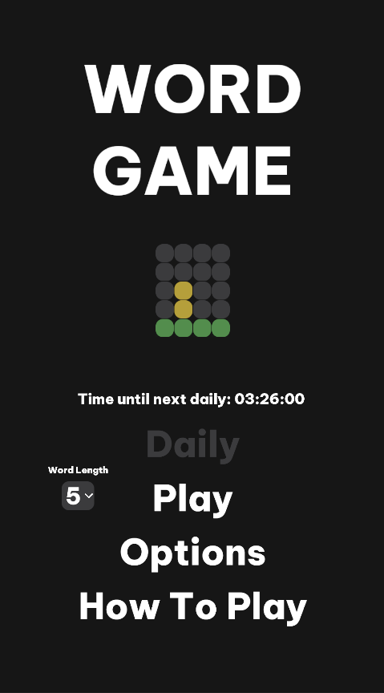

# WordGame
An open source word game based on wordle
  

This is a project I threw together in a weekend. Its a wordle clone written in the Unity Game engine. It takes the wordle gameplay and allows you to play it multiple times per day with a random word instead of a shared word based on time. I have tested it on Windows and Android and will host builds of the game on [my itch](https://josfeld.itch.io/word-game)

All of the code is licensed under the a [CC0](https://creativecommons.org/share-your-work/public-domain/cc0/) license which requires no attribution is required. Some of the images found in the Assets/Sprites folder do require attribution. The info for them can be found in Sources.txt.

